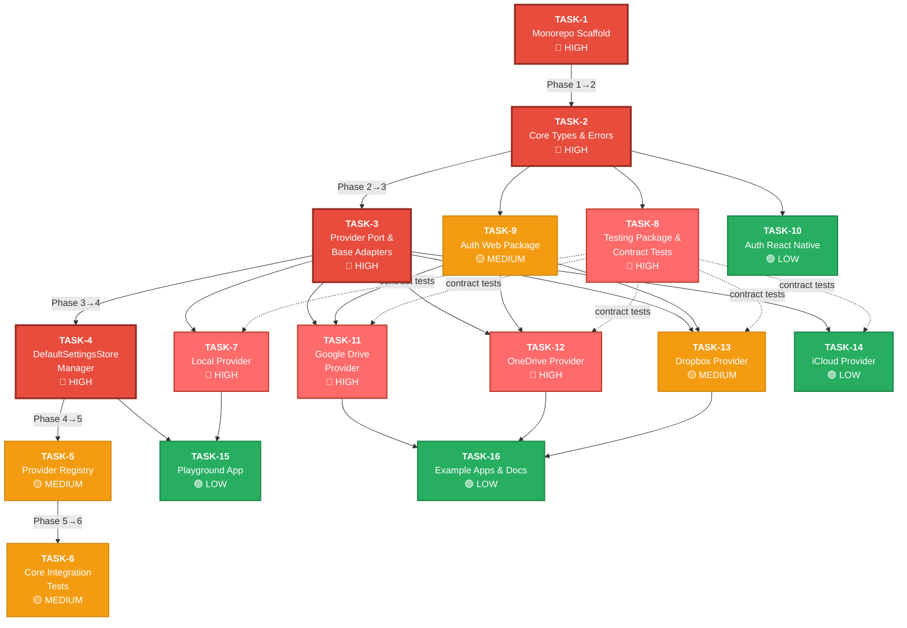
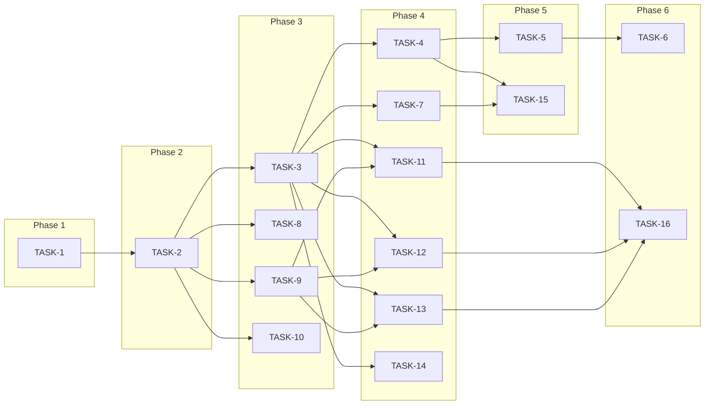

# Task Precedence and Interdependencies

This document maps all backlog tasks, their execution order, explicit and implicit dependencies, and identifies critical-path and parallelizable work.

## Dependency Summary Table

| Task | Title | Priority | Explicit Dependencies | Implicit Dependencies | Dependents (blocks) |
|------|-------|----------|----------------------|----------------------|---------------------|
| TASK-1 | Monorepo Scaffold | HIGH | — | — | TASK-2 |
| TASK-2 | Core Types and Error Classes | HIGH | TASK-1 | — | TASK-3, TASK-8, TASK-9, TASK-10 |
| TASK-3 | Provider Port and Base Adapters | HIGH | TASK-2 | — | TASK-4, TASK-7, TASK-11, TASK-12, TASK-13, TASK-14 |
| TASK-4 | DefaultSettingsStore Manager | HIGH | TASK-3 | — | TASK-5, TASK-15 |
| TASK-5 | Provider Registry | MEDIUM | TASK-4 | — | TASK-6 |
| TASK-6 | Core Integration Tests | MEDIUM | TASK-5 | — | — |
| TASK-7 | Local Provider | HIGH | TASK-3 | TASK-8 (contract tests) | TASK-15 |
| TASK-8 | Testing Package and Provider Contract Tests | HIGH | TASK-2 | — | TASK-7*, TASK-11*, TASK-12*, TASK-13*, TASK-14* |
| TASK-9 | Auth Web Package (Browser OAuth PKCE) | MEDIUM | TASK-2 | — | TASK-11, TASK-12, TASK-13 |
| TASK-10 | Auth React Native Package | LOW | TASK-2 | — | — |
| TASK-11 | Google Drive Provider | HIGH | TASK-3, TASK-9 | TASK-8 (contract tests) | TASK-16 |
| TASK-12 | OneDrive Provider | HIGH | TASK-3, TASK-9 | TASK-8 (contract tests) | TASK-16 |
| TASK-13 | Dropbox Provider | MEDIUM | TASK-3, TASK-9 | TASK-8 (contract tests) | TASK-16 |
| TASK-14 | iCloud Provider | LOW | TASK-3 | TASK-8 (contract tests) | — |
| TASK-15 | Playground App | LOW | TASK-4, TASK-7 | — | — |
| TASK-16 | Example Apps and Documentation | LOW | TASK-11, TASK-12, TASK-13 | — | — |

\* *Implicit dependency — provider implementations need the testing package's contract tests to validate conformance, but development can begin without it.*

## Execution Phases

The tasks naturally group into **6 execution phases** based on dependency depth. Within each phase, tasks can be worked on in parallel.

### Phase 1 — Foundation
- **TASK-1** — Monorepo Scaffold

> Everything depends on this. Must complete first.

### Phase 2 — Core Types
- **TASK-2** — Core Types and Error Classes

> All packages need these types. Single task, no parallelism.

### Phase 3 — Infrastructure (3 parallel tracks)
- **TASK-3** — Provider Port and Base Adapters
- **TASK-8** — Testing Package and Provider Contract Tests
- **TASK-9** — Auth Web Package (Browser OAuth PKCE)
- **TASK-10** — Auth React Native Package

> TASK-3, TASK-8, TASK-9, and TASK-10 can all start once TASK-2 is done. TASK-8 and TASK-9 are especially important to complete early as they unblock provider implementations.

### Phase 4 — Core Logic + First Providers (parallel tracks)
- **TASK-4** — DefaultSettingsStore Manager
- **TASK-7** — Local Provider (needs TASK-3; ideally also TASK-8)
- **TASK-11** — Google Drive Provider (needs TASK-3 + TASK-9; ideally also TASK-8)
- **TASK-12** — OneDrive Provider (needs TASK-3 + TASK-9; ideally also TASK-8)
- **TASK-13** — Dropbox Provider (needs TASK-3 + TASK-9; ideally also TASK-8)
- **TASK-14** — iCloud Provider (needs TASK-3; ideally also TASK-8)

> This is the widest phase. TASK-4 is on the critical path (blocks TASK-5 → TASK-6). All provider implementations can proceed in parallel once their dependencies from Phase 3 are complete.

### Phase 5 — Integration
- **TASK-5** — Provider Registry (needs TASK-4)
- **TASK-15** — Playground App (needs TASK-4 + TASK-7)

> TASK-5 continues the critical path. TASK-15 can start once both TASK-4 and TASK-7 are done.

### Phase 6 — Validation & Documentation
- **TASK-6** — Core Integration Tests (needs TASK-5)
- **TASK-16** — Example Apps and Documentation (needs TASK-11, TASK-12, TASK-13)

> Final phase. TASK-6 closes out the core pipeline. TASK-16 requires all three main cloud providers to be complete.

## Critical Path

The **critical path** (longest dependency chain determining minimum project duration):

```
TASK-1 → TASK-2 → TASK-3 → TASK-4 → TASK-5 → TASK-6
```

This 6-task chain must be completed sequentially and represents the minimum timeline for the core library to be fully tested and integrated.

## Parallelism Opportunities

The following task groups can be developed concurrently (great for subagent-driven-development or multiple contributors):

| Parallel Group | Tasks | Starts After |
|---------------|-------|-------------|
| Infrastructure | TASK-3, TASK-8, TASK-9, TASK-10 | Phase 2 (TASK-2) |
| Providers | TASK-7, TASK-11, TASK-12, TASK-13, TASK-14 | Phase 3 (TASK-3 + TASK-8/9) |
| Integration | TASK-5, TASK-15 | Phase 4 (TASK-4 + TASK-7) |
| Final | TASK-6, TASK-16 | Phase 5 (TASK-5 + TASK-11/12/13) |

## Dependency Graph



## Simplified Phase View



## Risk Areas

1. **TASK-3 (Provider Port)** is the highest-fan-out node — it blocks 6 other tasks. Any delay here cascades widely.
2. **TASK-9 (Auth Web)** blocks all three major cloud providers (TASK-11, TASK-12, TASK-13). Should be prioritized within Phase 3.
3. **TASK-8 (Testing Package)** is an implicit dependency for all provider conformance testing. Completing it early enables validation of all providers.
4. **TASK-4 → TASK-5 → TASK-6** is the critical-path tail end — sequential with no parallelism.
5. **TASK-16** has the most dependencies (3 providers) and represents the final delivery milestone.
